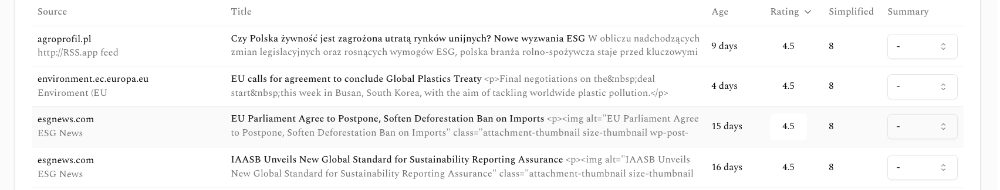

# Project overview
You are building a Newsletter Creator App that automates and streamlines the newsletter creation process for B2B marketers. The app allow users to select articles from a list and add their summaries to a newsletter.

You will be using the NextJS 15 as the framework, and TailwindCSS and Shadcn for styling, Lucid icon. The app will be using GraphQL API to fetch and store the data.

# Core functionalities
The app will:
* Present articles in a list 
** Articles will be presented in a list, with the title, description, and a "Add to newsletter" button.
** List should look like the following screenshot: 
** Allow users to select articles should be summarized, user should be able to select one of the following options: "Long", "Medium", "Short" (option determins type of summary)
** User should be able to filter by age of the article, the options are: "Last 24 hours", "Last 3 days", "Last week", "Last month", "Last year", "All time"
** User should be able to sort the articles by "Newest" or "Oldest"
** User should be able to add new article by clicking "Add new article" button, this will open a modal window where user can add the article URL

* Present a preview of the newsletter
** there should be a button "Generate newsletter" which will open new full screen tab with the newsletter preview


# Documentation

GraphQL API: 
Sample query which returns articles list:
```typescript
export interface UserArticle {
    source: string
    link: string
    title: string
    summary: string
    hostDomain:string
    relativeDate: string
    publishedDate?: Date
    score: Score
    rating: number
}

interface Score {
    depth_and_originality: number
    quality: number
    relevance: number
    rating: number
    simplified: number
}

interface ListUserArticlesResponse {
    listUserArticles: {
        link: string
        owner: string
        publishedDate: string
        source: string
        hostDomain: string
        summary: string
        title: string
        url: string
        score: Score
    }[]
}

export async function getUserArticles(): Promise<UserArticle[]> {
    const result = await client.graphql({
        query: `
            query ListUserArticles {
                listUserArticles {
                    link
                    owner
                    publishedDate
                    source
                    hostDomain
                    summary
                    title
                    url
                    score {
                        depth_and_originality
                        quality
                        rating
                        relevance
                        simplified
                    }
                }
            }
        `
    }) as GraphQLResult<ListUserArticlesResponse>

    const articles = result.data
    if (!articles?.listUserArticles) return []
    console.log(articles)

    return articles.listUserArticles.map((item) => ({
        source: item?.source ?? '',
        hostDomain: item?.hostDomain ?? '',
        link: item?.link ?? '',
        title: item?.title ?? '',
        summary: item?.summary ?? '',
        relativeDate: getRelativeTime(new Date(item?.publishedDate ?? ''), new Date()),
        publishedDate: new Date(item?.publishedDate ?? ''),
        score: item?.score,
        rating: item?.score?.rating / 10
    }));
}

function getRelativeTime(pastDate: Date, currentDate: Date): string {
    const diffInSeconds = Math.floor((currentDate.getTime() - pastDate.getTime()) / 1000);

    const intervals = [
        {label: 'year', seconds: 365 * 24 * 60 * 60},
        {label: 'month', seconds: 30 * 24 * 60 * 60},
        {label: 'day', seconds: 24 * 60 * 60},
        {label: 'hour', seconds: 60 * 60},
        {label: 'minute', seconds: 60},
        {label: 'second', seconds: 1},
    ];

    for (const interval of intervals) {
        const count = Math.floor(diffInSeconds / interval.seconds);
        if (count >= 1) {
            return `${count} ${interval.label}${count > 1 ? 's' : ''}`;
        }
    }
    return 'just now';
}

```
Create newsletter mutation:
```typescript
      const result = await client.graphql<CreateNewsletterResponse>({
        query: `mutation CreateUserNewsletter($input: CreateNewsletterInput!) {
          createNewsletter(input: $input) {
            id
            createdAt
            owner
            status
            updatedAt
            articles {
              long
              medium
              short
            }
          }
        }`,
        variables: {
          input
        }
      }) as GraphQLResult<CreateNewsletterResponse>;
```

Fetch newsletter:
```typescript
export async function getUserNewsletter(newsletterId: string): Promise<GetNewsletterResponse['getNewsletter']> {
    const client = generateClient();
    const query = /* GraphQL */ `
        query ListUserArticles {
            getNewsletter(id: "${newsletterId}") {
                articles {
                    long
                    medium
                    short
                }
                baseNewsletter
                createdAt
                owner
                status
                updatedAt
                id
            }
        }
    `;

    try {
        const response = await client.graphql({
            query,
        }) as GraphQLResult<GetNewsletterResponse>;

        if (!response.data?.getNewsletter) {
            throw new Error('Newsletter not found');
        }
        return response.data.getNewsletter;
    } catch (error) {
        console.error('Error fetching newsletter:', error);
        throw error;
    }
}
```

# Project file structure

├── README.md
├── next-env.d.ts
├── next.config.ts
├── package-lock.json
├── package.json
├── postcss.config.mjs
├── public
│   ├── file.svg
│   ├── globe.svg
│   ├── next.svg
│   ├── vercel.svg
│   └── window.svg
├── src
│   └── app
├── tailwind.config.ts
└── tsconfig.json