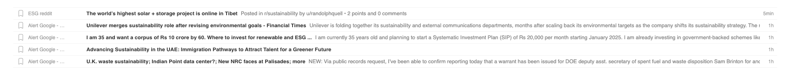

# Product Requirements Document (PRD)

## Project Overview

The Newsletter Creator App is designed to automate and streamline the newsletter creation process for B2B marketers. The application allows users to select articles from a list, choose the type of summary for each article, and generate a newsletter preview. The app is built using Next.js 15, TailwindCSS, Shadcn, and Lucide Icons. Data fetching and storage are handled via a GraphQL API.

## Goals and Objectives

- **Efficiency**: Simplify the newsletter creation process by automating article summarization and newsletter assembly.
- **User-Friendly Interface**: Provide an intuitive UI for selecting articles, customizing summaries, and generating previews.
- **Scalability**: Ensure the app is scalable and maintainable by using modern frameworks and best practices.

## Core Functionalities

### 1. Article List Presentation

- **Display Articles**: Present articles in a list format, showing five columns: the hostName, the title + summary, score.rating, score.simplified, and relative date.
- **"Mark Article to be added to Newsletter"**: Each article should have a checkbox that allows users to select it for the newsletter.
- **Summary Options**: Users can select the desired summary length for each article, default Medium:
  - Long
  - Medium
  - Short
- **Filtering Options**: Users can filter articles by their age:
  - Last 24 hours
  - Last 3 days
  - Last week
  - Last month
  - All time
- **Add New Article**: An "Add New Article" button allows users to input a new article URL via a modal window.

### 2. Newsletter Preview

- **Generate Newsletter**: A "Generate Newsletter" button that opens a new full-screen browser tab displaying the newsletter preview. 
- **Preview Content**: Show the selected articles summaries in the newsletter format. The newsletter is fetch from the API.

## User Interface Design

### Frameworks and Libraries
- **Next.js 15**: For server-side rendering and routing
- **TailwindCSS**: For utility-first CSS styling
- **Shadcn**: For reusable UI components
- **Lucide Icons**: For consistent and modern iconography

### Design Considerations
- Articles List, similar to feedly.com 
- Accessibility compliance (e.g., ARIA labels)

## Technical Requirements

### Frontend
- **Language**: TypeScript for type safety
- **State Management**: React's built-in state management or Context API
- **Routing**: Utilize Next.js routing for navigation between pages
- **API Integration**: Implement GraphQL queries and mutations for data fetching and updating

### Styling
- **TailwindCSS**: Apply utility classes directly in JSX for styling components
- **Component Library**: Use Shadcn components for consistent UI elements
- **Icons**: Import Lucide icons where needed

### Performance Optimizations
- Code splitting and lazy loading
- Memoization where appropriate

## API Documentation

### Fetching Articles: `getUserArticles()`

Fetches a list of articles available to the user.

#### TypeScript Interfaces
```typescript
export interface UserArticle {
  link: string;
  title: string;
  summary: string;
  hostDomain: string;
  relativeDate: string;
  publishedDate?: Date;
  score: Score;
  rating: number;
}

interface Score {
  depth_and_originality: number;
  quality: number;
  relevance: number;
  rating: number;
  simplified: number;
}

export async function listUserArticles(startDate: Date): Promise<UserArticle[]> {
    const result = (await client.graphql({
        query: `
        query ListUserArticles($startDate: String!) {
          listUserArticles(input: {startDate: $startDate}) {
            items {
              link
                    owner
                    publishedDate
                    hostDomain
                    summary
                    title
                    url
                    score {
                        depth_and_originality
                        quality
                        rating
                        relevance
                        simplified
                    }
            }
          }
        }
    `,
    variables: {
      startDate: startDate.toISOString(),
    }
    })) as GraphQLResult<ListUserArticlesResponse>;

    const articles = result.data;
    if (!articles?.listUserArticles) return [];
    console.log(articles);

    return articles.listUserArticles.items.map((item) => ({
        source: item?.source ?? "",
        hostDomain: item?.hostDomain ?? "",
        link: item?.link ?? "",
        title: item?.title ?? "",
        summary: item?.summary ?? "",
        relativeDate: getRelativeTime(
            new Date(item?.publishedDate ?? ""),
            new Date()
        ),
        publishedDate: new Date(item?.publishedDate ?? ""),
        score: item?.score,
        rating: item?.score?.rating / 10,
    }));
}


```

### Creating a Newsletter: `createNewsletter()`

#### Purpose
Sends a mutation to create a new newsletter with selected articles.

#### Sample Implementation
```typescript
interface CreateNewsletterResponse {
  createNewsletter: {
    id: string;
    createdAt: string;
    owner: string;
    status: string;
    updatedAt: string;
    articles: {
      long: string[];
      medium: string[];
      short: string[];
    };
  };
}


const result = await client.graphql<CreateNewsletterResponse>({
  query: `
    mutation CreateUserNewsletter($input: CreateNewsletterInput!) {
      createNewsletter(input: $input) {
        id
        createdAt
        owner
        status
        updatedAt
        articles {
          long
          medium
          short
        }
      }
    }
  `,
  variables: {
    input,
  },
}) as GraphQLResult<CreateNewsletterResponse>;
```

### Fetching a Newsletter: `getUserNewsletter()`

#### Purpose
Retrieves a newsletter by its ID for preview.

#### Sample Implementation
```typescript
export async function getUserNewsletter(newsletterId: string): Promise<GetNewsletterResponse['getNewsletter']> {
  const client = generateClient();
  const query = /* GraphQL */ `
    query GetNewsletter {
      getNewsletter(id: "${newsletterId}") {
        articles {
          long
          medium
          short
        }
        baseNewsletter
        createdAt
        owner
        status
        updatedAt
        id
      }
    }
  `;

  try {
    const response = await client.graphql({
      query,
    }) as GraphQLResult<GetNewsletterResponse>;

    return response.data.getNewsletter;
  } catch (error) {
    console.error('Error fetching newsletter:', error);
    throw error;
  }
}
```

## Project File Structure

```
├── README.md
├── next-env.d.ts
├── next.config.ts
├── package-lock.json
├── package.json
├── postcss.config.mjs
├── public
│   └── [various SVG files]
├── src
│   ├── app
│   │   ├── page.tsx
│   │   ├── newsletter-preview.tsx
│   │   ├── components
│   │   │   ├── ArticleList.tsx
│   │   │   ├── ArticleItem.tsx
│   │   │   ├── FilterBar.tsx
│   │   │   ├── AddArticleModal.tsx
│   │   │   └── SummarySelector.tsx
│   │   └── styles
│   │       └── globals.css
│   ├── graphql
│   │   ├── queries.ts
│   │   └── mutations.ts
│   └── utils
│       └── dateUtils.ts
├── tailwind.config.ts
└── tsconfig.json
```

## Data Flow and State Management

### State Variables
- `articles`: List of articles fetched from the API
- `selectedArticles`: Articles selected for the newsletter
- `filters`: Current filter and sort options
- `showModal`: Boolean to control the visibility of AddArticleModal

### Data Fetching
- Use `getUserArticles` on component mount to fetch articles
- Use `getUserNewsletter` when navigating to the newsletter preview

### Event Handling
- Adding Articles: Updates `selectedArticles` state
- Filtering/Sorting: Updates `filters` state and re-fetches or re-filters articles
- Adding New Articles: Submits new article via API and updates the article list

## Error Handling and Validation

### Article Fetching
- Display a loader while fetching data
- Show an error message if the fetch fails

### Adding New Articles
- Validate URL input
- Show feedback if the article cannot be added

### API Calls
- Implement try-catch blocks
- Gracefully handle errors and inform the user

## Testing and Quality Assurance

### Unit Tests
- Test utility functions like `getRelativeTime`
- Test components for proper rendering

### Integration Tests
- Test API interactions
- Simulate user interactions for adding articles and generating newsletters

### End-to-End Tests
- Use tools like Cypress to test user flows

## Deployment and Environment Setup

### Development Environment
- Node.js and npm installed
- Run `npm install` to install dependencies
- Run `npm run dev` to start the development server

### Production Build
- Run `npm run build` to create a production build
- Run `npm start` to start the application in production mode

### Environment Variables
- Store API endpoints and keys securely
- Use `.env.local` for local development

## Dependencies and Tools

### Frameworks
- Next.js 15
- React

### Languages
- TypeScript

### Styling
- TailwindCSS
- Shadcn components

### Icons
- Lucide Icons

### GraphQL
- Apollo Client or equivalent for GraphQL operations

### Testing
- Jest
- React Testing Library

### Utilities
- Date-fns or equivalent for date manipulation (if needed)


## Future Enhancements
- User Authentication: Implement user login and personalized data
- Customization Options: Allow users to customize newsletter templates
- Analytics: Provide insights on article engagement or newsletter performance
